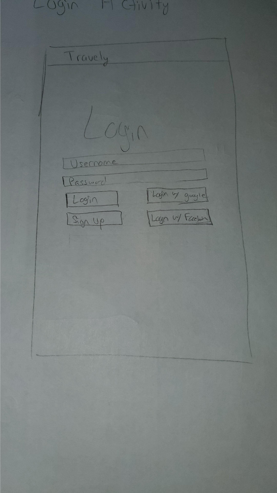
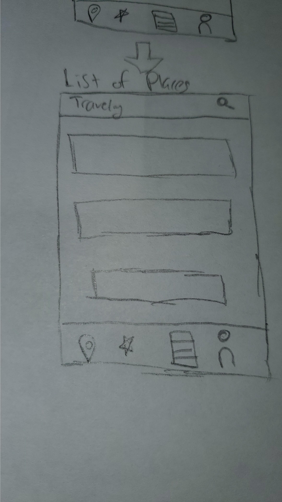
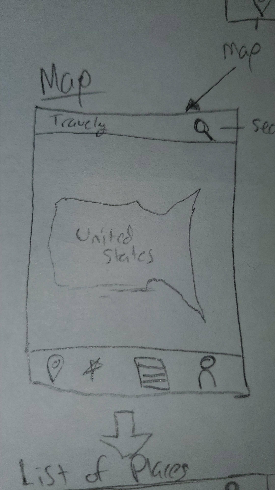
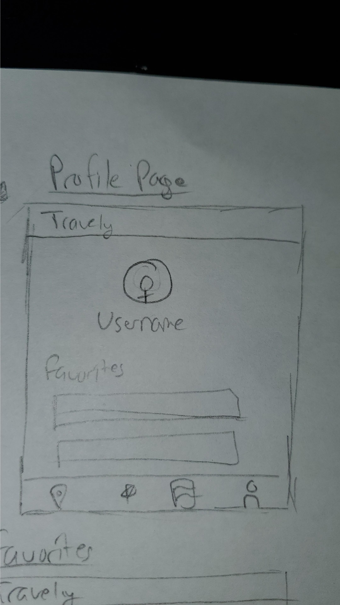
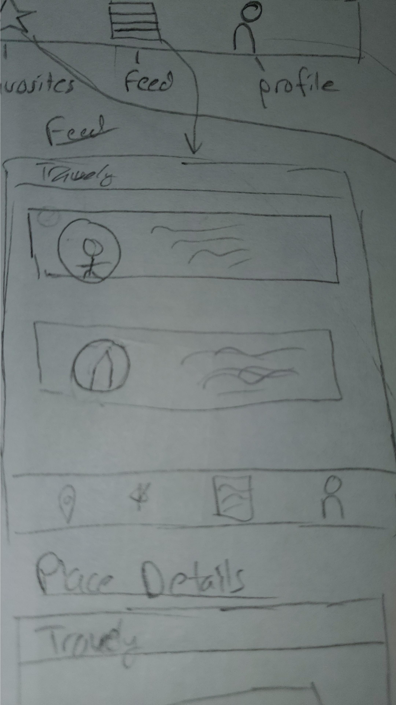
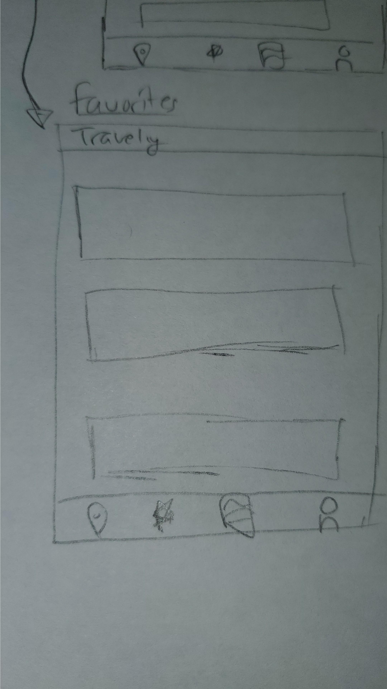

Original App Design Project - README Template
===

# Travely

## Table of Contents
1. [Overview](#Overview)
1. [Product Spec](#Product-Spec)
1. [Wireframes](#Wireframes)
2. [Schema](#Schema)

## Overview
### Description
A traveling app! An app where the user can select a point on a map where they are currently or going to view all of the popular spots in the area selected. Douple tapping a selected area will favorite it and leave it for you to view later. You can even share your list with friends, or see their lists.

### App Evaluation
[Evaluation of your app across the following attributes]
- **Category: Lifestyle**
- **Mobile: This app is great on a phone since you are always on the go while traveling. Having it on your phone is much more accessible rather than on a computer. This is especially the case with communicating with friends and sharing lists on the go**
- **Story: Organizes all of the information a person needs/wants in a single place for them to fulfill their dreams and goals of traveling. You can even share these personalized lists with friends**
- **Market: Anybody who wants to travel or go on vacation. Schools and clubs can even use the app for field trips or convention trips**
- **Habit: Looking through comments and sharing locations with friends can become addicting. Users continously will want to come back and see what pictures their friends shared with them**
- **Scope: It will be a local storage of places within California. Users that want to find a place in california near them or accross the state. It can turn into a map of the country, then of the world. It can also potentially included a social media feel where you can meet others with similar lists.**

## Product Spec

### 1. User Stories (Required and Optional)

**Required Must-have Stories**

* Users must be able to login/logout
* User must be able to create an account
* Clicking on the map should bring you to that specific city with a list(recycler view) of popular places in the vicinity
* Clicking the favorites button should let you add a place to your favorites list
    * some sort of toast saying "Added to Favorites"
    * able to remove places from your favorites list
    * This option will be on the place details page
* Tapping a place should give you details of that place
    * Pictures, rating, reviews, add a review(link it to google maps reviews)
* Share your list or any specific location with a friend on Facebook
* Feed fragment where it shows your friends favorites lists
* Zoom in animation once map point was clicked in

**Optional Nice-to-have Stories**

* Post pictures of places on feed
* add your own review
* sort favorites by most popular
* You can look at your friends lists on their page
* customize user pages with facebook information
* a search option where you dont have to click the map and can go to a specific place right away
    * search option will appear on the favorites, placelist, and map page in order to look for a particular place

### 2. Screen Archetypes

* Login Screen
   * User must be able to login/create an account
* The map
   * User is able to click the map and have a zoomin animation into the designated spot which was clicked
* A listview of pictures in the area you selected
    * The place chosen from the map must bring you to a page filled with different places travelers would like to go to.
* Places details page
    * Places must show user ratings from the google API
    * where you will be able to favorite to add to your personalized list of places
* Favorites Page
    * User must be able to double tap a place in order to favorite it
    * Show all the places that have been favorited and can remove or share
* Feed
    * shows posts of users with their favorites list
    * complex algorithm will sort them based on locations

### 3. Navigation

**Tab Navigation** (Tab to Screen)

* Home(The Map)
* Favorites
* Feed
* Account

**Flow Navigation** (Screen to Screen)

* Intro screen
    * takes you to either login or signup based on what you click
* Login or Signin Screen
    * Takes you to the actual app now
* Map screen
    * Here you can click where you'd like to go on the map
    * It will navigate you to the places list page
* Popular places screen
    * shows popular business based on the location you selected
    * Takes you to place details page once a user clicks on a specific place
* Place details
    * shows a picture, rating, and reviews based on the place you selected from the list
    * From here you can either go back via the android back button or use the navigation view
    * using the navigation view will take you to either map, favorites, or account info  (can take you to feed if implimented)
* Feed
    * can be accessed from the bottom navigation view
    * users will be able to post their favorites list
    * Each post will have their profile picture alongisde their favorites list with just the names of the places in their favorites list
* Profile
    * can be accessed from the bottom navigation view
    * you will have a button to log out from here an

## Wireframes
[Add picture of your hand sketched wireframes in this section]

### [BONUS] Digital Wireframes & Mockups

### [BONUS] Interactive Prototype

## Schema
[This section will be completed in Unit 9]
### Models
[Add table of models]
### Networking
- [Add list of network requests by screen ]
- [Create basic snippets for each Parse network request]
- [OPTIONAL: List endpoints if using existing API such as Yelp]
